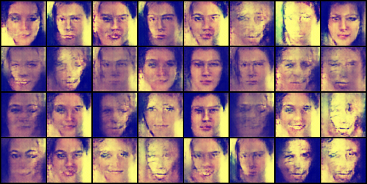

# HW3 ― GAN, ACGAN and UDA

This is a project part of the course "Deep Learning and Computer Vision" of National Taiwan University. A GAN and an ACGAN is implemen ted for generating human face images and a DANN for classifying digit images from different domains.

### Dataset
In the starter code of this repository, we have provided a shell script for downloading and extracting the dataset for this assignment. For Linux users, simply use the following command.

    bash ./get_dataset.sh
The shell script will automatically download the dataset and store the data in a folder called `hw3_data`. Note that this command by default only works on Linux. If you are using other operating systems, you should download the dataset from [this link](https://www.dropbox.com/s/65qdt9rkt808an4/hw3_data.zip) and unzip the compressed file manually.
